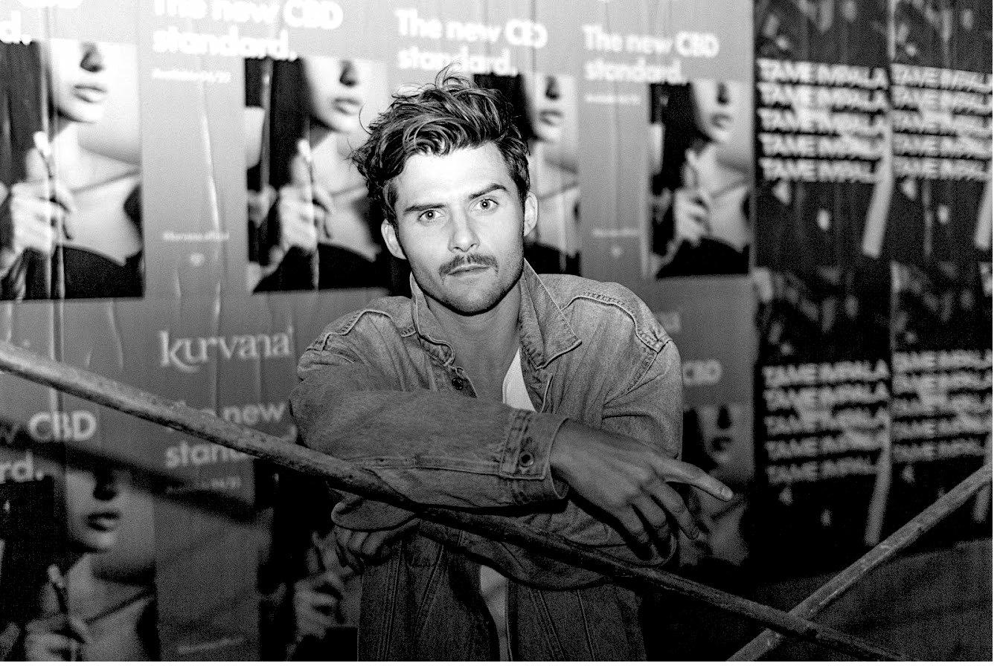
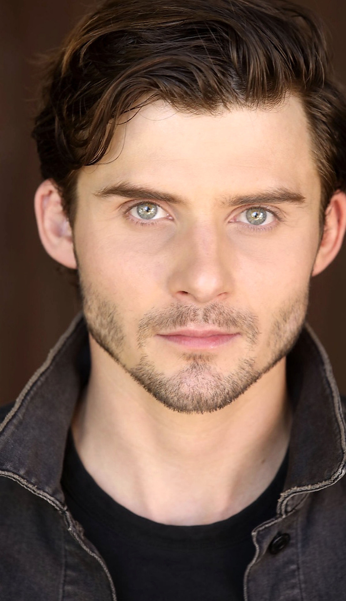
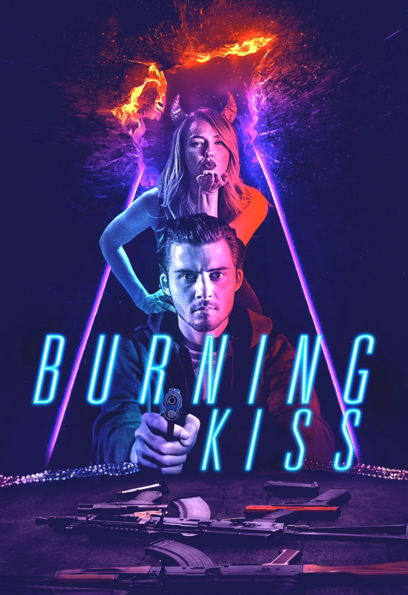
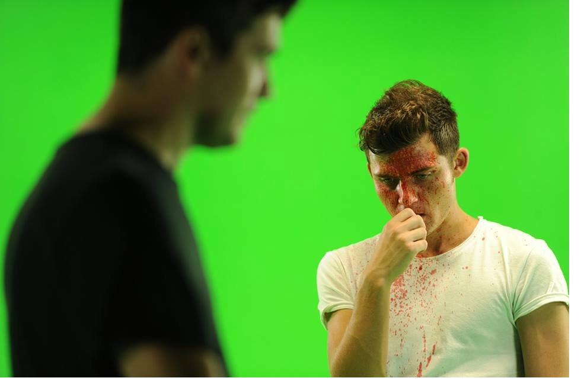

# Liam Graham — Actor Portfolio

A bespoke editorial portfolio site for **Liam Graham**, a Scottish‑born Australian screen actor. Built by [The Daly Creative](https://thedalycreative.com).

| | |
|---|---|
| **Live site** | _Coming soon at a custom domain_ → `https://YOUR-DOMAIN.com` *(placeholder — pending purchase)* |
| **Vercel project** | https://vercel.com/thedalycreative/liam-graham-actor |
| **Source** | https://github.com/thedalycreative/liam-graham-actor |
| **IMDb** | https://www.imdb.com/name/nm4223899/ |

---

## At a glance



> A six‑page cinematic site that opens like a film and earns the next click from a casting director.

---

## The brief

Liam had years of credits — *Greenfield*, *Burning Kiss*, *The Heights*, *Hounds of Love*, *Into the Dark* — but no central place that did them justice. The brief was small but exacting.

- **Editorial, not "actor template."** Feel like a film magazine, not a resumé.
- **Load fast.** Casting people scan; they don't wait.
- **Work on a phone** for the agent reading it between meetings.
- **Show range** — not just *what he looks like* but *who he can become*.



---

## What we built

A single design system across six pages — warm cream backgrounds (and a hand‑tuned dark mode), a gold accent the same temperature as cinema lighting, and a serif/display type pairing that reads like a press kit.

| Page | What it does |
|---|---|
| **Home** | Hero slideshow that slow‑zooms on load, featured credits, showreel teaser. |
| **Credits** | The full filmography, filterable by medium and genre. |
| **Characters** | A lightboxed range gallery — a director can step through Liam's transformations in seconds. |
| **Awards** | Wins, nominations, and laurels — including the *Greenfield* Best Actor win. |
| **News** | Press coverage and editorial features. |
| **Contact** | Casting and representation enquiries. |



### Detail choices

- **Cinematic image system** — every image lives inside an aspect‑ratio container (16:7 hero, 16:9 cinematic, 3:4 portrait, 2:3 poster) so layouts never reflow as photos load.
- **Slow parallax** on the hero and gentle scroll‑reveal animations on every section — present without being showy.
- **Film‑grain overlay** at low opacity across every page for an analogue feel.
- **Light / dark mode toggle** in the top‑right of every page — remembers your choice, defaults to your system setting.
- **Lightbox gallery** on the Characters page with keyboard escape.
- **Magnetic buttons** on desktop (subtle cursor‑follow) — disabled on touch devices.
- **No build step.** Hand‑written HTML, CSS, and vanilla JavaScript. One stylesheet, one script file, no framework you can break in eight months.



---

## What's in this repo

```
liam-graham-actor/
├── index.html          # Home
├── credits.html        # Filmography
├── characters.html     # Character range
├── awards.html         # Awards & nominations
├── news.html           # Press
├── contact.html        # Contact
├── css/style.css       # Design system + every style on the site
├── js/main.js          # Scroll reveals, lightbox, theme toggle, slideshow
├── images/             # 40 images — every one is used by a page
└── archive/            # Source assets (raw shoots, alt posters) — not deployed
```

---

## Tech notes

Plain HTML / CSS / JS. No framework, no build step, no dependencies in production. Deploys automatically from `main` to Vercel; previews build on every pull request.

Run locally:

```bash
npm run dev   # serves at http://localhost:3000
```

---

## Credits

- **Subject** — Liam Graham · [IMDb](https://www.imdb.com/name/nm4223899/) · [@liamansellgraham](https://www.instagram.com/liamansellgraham/)
- **Design & build** — [The Daly Creative](https://thedalycreative.com)

For **casting, representation, and professional enquiries** — see the [contact page](contact.html) or DM Liam on Instagram.

---

© Liam Graham. All rights reserved. All images, copy, and brand assets in this repository are the property of Liam Graham and may not be reused without written permission.
